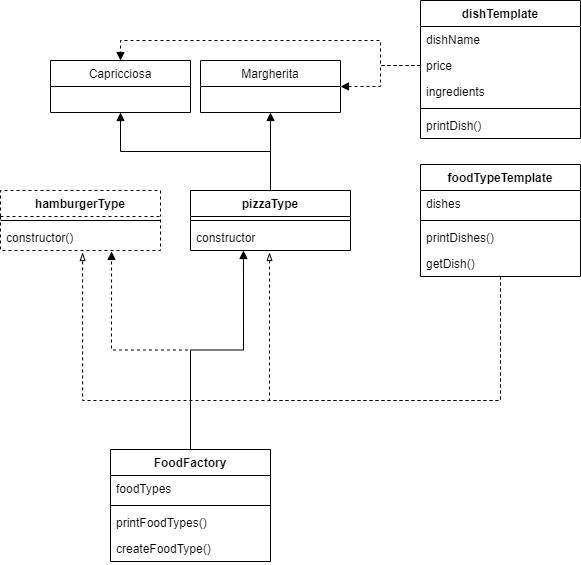
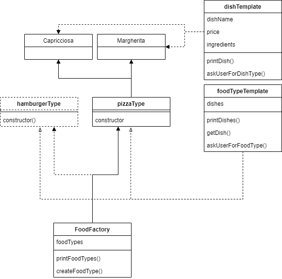
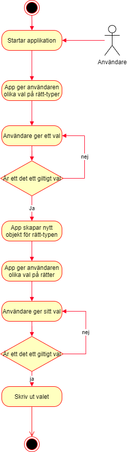

# OOAD-individuellt
Individuell inlämingsuppgift.

## Godkänt
- [x] Välj 3 valfria designmönster från boken ”Learning JavaScript Design Patterns” https://addyosmani.com/resources/essentialjsdesignpatterns/book/
- [x] Du ska beskriva med dina egna ord (på svenska) dina 3 olika designmönster.
- [x] Skapa ett valfritt utvecklingsprojekt (JavaScript-applikation),där du använder minst ett av dina valda designmönster.
- [x] Du behöver dokumentera ditt projekt med dina egna ord och diagram. Modellera några relevanta UML-diagram. Använd Lucidchart.com eller ett annat valfritt modelleringsverktyg

## VG 
- [x] Skriv mer djupgående OOAD utifrån ditt eget utvecklingsprojekt. Analysen ska visa på en god förståelse för projektets mål och användarbehov.
- [x] Du ska visa en god förståelse för skillnaderna mellan dina 3 designmönster samt deras olika tillämpningsmöjligheter i praktisk programmering.

# 1. Val av designmönster
1. Factory Pattern https://addyosmani.com/resources/essentialjsdesignpatterns/book/#factorypatternjavascript
2. Facade Pattern https://addyosmani.com/resources/essentialjsdesignpatterns/book/#facadepatternjavascript
3. Constructor Pattern https://addyosmani.com/resources/essentialjsdesignpatterns/book/#constructorpatternjavascript

# 2. Beskriv designmönster med egna ord
Jag valde designmönster Constructor pattern, Facade pattern och Factory pattern, där Factory- och Constructor-pattern är skapande mönster, medan Facade är ett struktuellt mönster.

## Skillnader mellan designmönster
Skapande mönster är design mönster som hanterar skapande av objekt, eller initiering av ett objekt, den ska det vill säga lösaa problemet med att på något vis kunna kontrollera objektet som skapas.

Struktuellt mönster är ett design mönster som används för att identifiera och underlätta strukturen av klasser och funktioner genom generella mönster.

Beteende mönster är ett design mönster som används för att hitta vanliga kommunikation mönster mellan olika objekt, så att objekten på ett enkelt sätt kan samspela med varandra utan att vara allt för mycket beroende av varandra. 

## Factory pattern
**Factory pattern** är ett designmönster som används för att skapa en instans av en klass och gömma själva instansen för skapandet av objektet för användaren. Detta ger utvecklaren då möjlighet att utöka factoryn utan att befintlig kod som använder factoryt blir påverkad.

Praktiskt exempel, tänk dig att du har en hamburgarresturang, där kunder kan beställa olika hamburgare. Där hamburgare har olika innehåll.

I exemplet nedan så har vi fyra olika hamburgare:
- Naturel burgare
- Bacon burgare
- Ost burgare
- Ägg burgare

Med HamburgerFactory, så kan vi skapa olika hamburgare instanser beroende på vad vi får in i vår createFactory metod.
```JavaScript
class BurgerTemplate {
    burger;
    printBurger() {
        console.log(`You've choosen a ${this.burger}`);
    }
}

class BaconBurger extends BurgerTemplate {
    burger = "Bacon Burger";
    constructor() {
        super();
    }
}

class NaturalBurger extends BurgerTemplate {
    burger = "Natural Burger";
    constructor() {
        super();
    }
}

class CheeseBurger extends BurgerTemplate {
    burger = "Cheese Burger";
    constructor() {
        super();
    }
}

class EggBurger extends BurgerTemplate {
    burger = "Egg Burger";
    constructor() {
        super();
    }
}

class HamburgerFactory {
    allowedBurgers = new Map([
        ['BaconBurger', BaconBurger],
        ['NaturalBurger', NaturalBurger],
        ['CheeseBurger', CheeseBurger],
        ['EggBurger', EggBurger]
    ]);

    defaultBurger = "NaturalBurger"

    createBurger(burgerType = undefined) {
        try {
            return new (this.allowedBurgers.get(burgerType || this.defaultBurger))();
        } catch(error) {
            console.log(`The burger you tried to order, does not exist!`);
        }
    }
}

const burgerFactory = new HamburgerFactory();

const FirstBurger = burgerFactory.createBurger('BaconBurger');
FirstBurger.printBurger(); // Outputs: You've choosen a Bacon Burger

const SecondBurger = burgerFactory.createBurger();
SecondBurger.printBurger(); // Outputs: You've choosen a Natural Burger

// A burger that does not exists.
const ThirdBurger = burgerFactory.createBurger("Unknown!");
```
I och med att vi använder oss av Factory pattern, gör att vi också kan utöka vår factory enkelt, utan att påverka befintlig kodbas. 
Om vi skulle vilja lägga till exempelvis, Vegan burger, så skapar vi en veganBurger klass och lägger till den i allowedBurgers.
Ex.
```javascript
class VeganBurger extends BurgerTemplate {
    burger = "Vegan Burger";
    constructor() {
        super();
    }
}

class HamburgerFactory {
    allowedBurgers = new Map([
        ['BaconBurger', BaconBurger],
        ['NaturalBurger', NaturalBurger],
        ['CheeseBurger', CheeseBurger],
        ['EggBurger', EggBurger],
        ['VeganBurger', VeganBurger]
    ]);

    defaultBurger = "NaturalBurger"

    createBurger(burgerType = undefined) {
        try {
            return new (this.allowedBurgers.get(burgerType || this.defaultBurger))();
        } catch(error) {
            console.log(`The burger you tried to order, does not exist!`);
        }
    }
}
```

## Facade Pattern
**Facade Pattern** är ett strukturerat designmönster, där hela poängen egentligen är att göra en metod eller klass mindre abstrakt för användaren.

Ett praktiskt exempel är t.ex. när du ska göra ett POST anrop med hjälp av fetch så behöver du ha med en del overhead information för att utföra ett post-anropp.
Om du redan vet att du alltid kommer posta med samma overhead information, så kan du bygga en fasad för den orginella funktionen.

Nedan har du ett exempel på hur det skulle kunna se ut att bygga en fasad för en funktion:
```JavaScript
async function fetchData(url, method = "GET", data = undefined) {
    let header = {
        "method": method.toUpperCase(),
    };
    if(data) {
        header.headers = {
            "Content-Type": "application/json"
        };
        header.body = JSON.stringify(data);
    }
    return await fetch(url, header).then(response => resoponse.json());
}


function post(url, body) {
    return fetchData(url, "POST", body);
}

function get(url) {
    return fetchData(url);
}


post('localhost:8080/somePath', {Hello: "World!"});
get('localhost:8080/someOtherPath');
```

## Constructor Pattern
**Constructor pattern** tillhör kategorien skapande mönster och förbereder objektet för användning, som att sätta default värden, direkt exekvera en metod när objektet skapas och / eller sätta värden på egenskaper i ett objekt baserat på inkomna argument.

I ES6 är det väldigt enkelt att skapa en constructor:
```javascript
class DemoClass {
    constructor(SomeRequiredValue, SomeNonRequriedValue = undefined) {
        this.myReqiredValue = SomeRequiredValue;
        this.myDefaultValue = SomeNonRequriedValue || "DefaultVaule";
    }
}
```
I ES5 så är det lite krångligare att skapa en constructor:
```javascript
var DemoClass = (function() {
    var Constructor = function(SomeRequiredValue, SomeNonRequriedValue = undefined) {
        this.myReqiredValue = SomeRequiredValue;
        this.myDefaultValue = SomeNonRequriedValue || "DefaultVaule";
    };
    return Constructor;
})();
```

# 3. Skapa ett valfritt utvecklingsprojekt

1. Strategy – Den strategiska nivån
Den första nivån handlar om användarbehov och produktmål. (Varför? Vem?)
2. Scope – Omfattningsnivån
Handlar främst om kravspecifika 
(funktionella specifikationer och innehållskrav). (Vad?)

## 1. Strategi 

### Intervju
Jag äger idag en pizzaresturang där jag vill att sina matgäster snabbt och enkelt skall kunna få fram en lista på olika pizzor och priser på pizzorna, samt produkternas innehåll för att spara tid för personalen att upprepa sig vad varje produkt innehåller. Sedan skall matgästerna kunna beställa en specifik pizza. Jag vill i framtiden också kunna enkelt utöka utbudet till andra typer av rätter, exempelvis hamburgare och / eller asiatiskt eller någon annan typ av rätt.

Om jag utökar med andra typer av rätter, så vill jag att matgästerna ska få välja vilken typ av rätt som skall visa. Klienten ska bara kunna välja en rätt.


### Vem är produkten för
Produkten kommer att användas av matgästerna

### Varför behövs produkten
Den möjligör för matgästerna att dem enklare och snabbare skall kunna beställa sin rätt utan att behöva kommunicera med en kassör.
Samt så lättar det för personalen för de vanligaste frågorna, så som pris och vad maten innehåller.

## 2. Omfattning
Utifrån intervjun, så är det klart att det är främst tre punkter som ligger i vikt för resturangägaren:

### Innehåll
- Önskar att applikationen skall visa en lista på olika rätter med namn, innehåll och pris.
### Funktionalitet
- Matgästerna skall kunna beställa en rätt.
- Applikationen ska enkelt kunna utökas med andra typer av rätter

## 3. Dokumentation

I utvecklingsprojektet, så är planen att använda mig av designmönstret Factory pattern. Orsaken är att detta designpattern gör det enklare att skapa olika objekt beroende på användarens inmatning av data, vilket är ett av kraven från intervjun med ägaren.

Utöver Factory pattern så kommer jag också använda mig av Facade pattern för att förenkla två komplicerade funktioner.

Där första är en modul som heter `readline`, som innehåller en metod jag vill använda som heter `question`. Tyvärr är inte readline modulen asynkront så jag behöver göra så att min kod inte fortsätter när denna metod kallas på. 

Den andra funktionen så behöver jag ett lättare sätt att kontrollera att användarens inmatade data är validerad.

### Klassdiagram
Jag upptäckte vid utveckligen av applikationen att både dishTemplate och foodTypeTemplate klasserna behövde metoder att kunna kommunicera med själva användaren, och där av behövde lägga till metoderna: askUserForFoodType och askUserForDishType.
Där av har jag två versioner av klassdiagrammet:

**Version 1**



**Version 2**


### Aktivitetsdiagram
Aktivitetsdiagrammet beskriver hur användarenens steg för att beställa en rätt.

1. Användaren startar själva applikationen med `node ./app.js`
2. Applikationen skriver ut en meny, där användaren får välja olika typer av rätter. Just i dagsläget har resturangen bara Pizza.
3. Applikationen efterfrågar inmatning från användaren om vilken rätttyp användaren vill ha.
4. Applikationen kontrollerar om inmatningen är korrekt eller inte. Om det inte är korrekt skall applikationen gå tillbaka till punk 3.
5. Applikationen skapar objektet som användaren har valt.
6. Applikationen skriver ut vilka rätter som finns att välja.
7. Applikationen efterfrågar inmatning från användaren om vilken rätt användaren vill ha.
8. Applikationen kontrollerar om inmatningen är korrekt eller inte. Om det inte är korrekt skall applikationen gå tillbaka till punk 7.
9. Applikationen skriver ut valet.
10. Applikationen stängs av.


